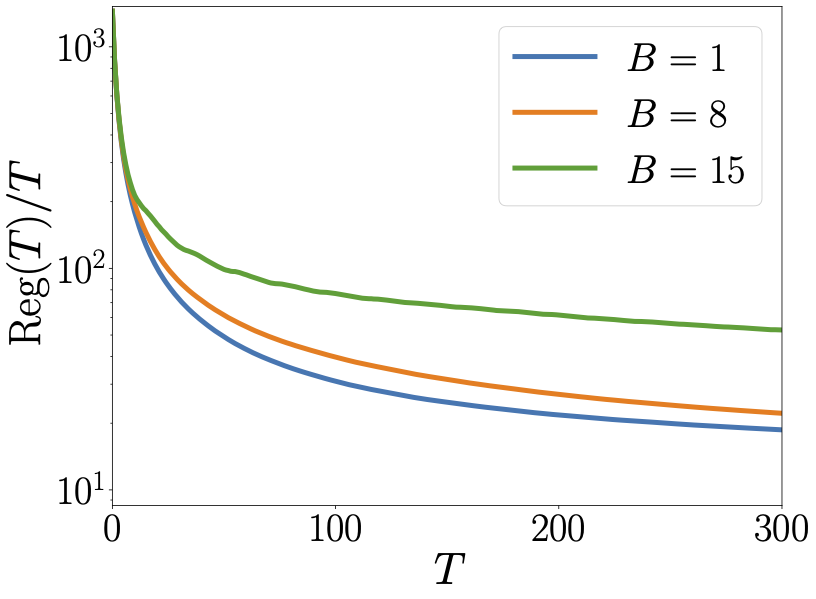
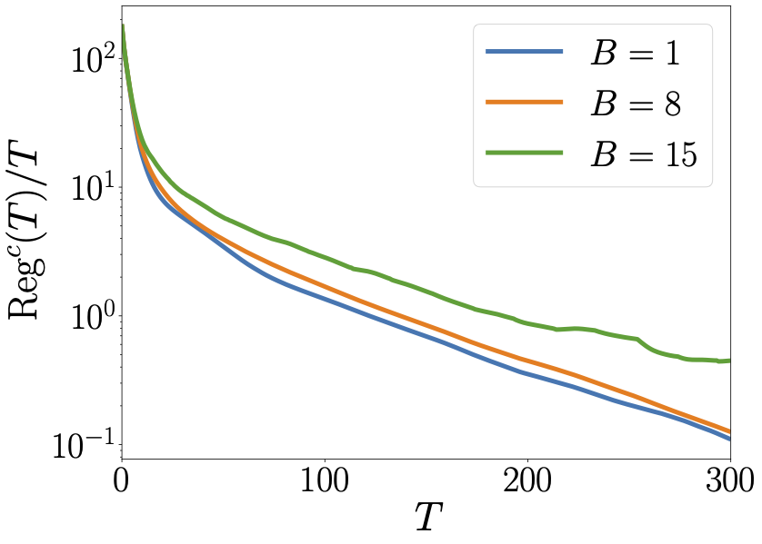
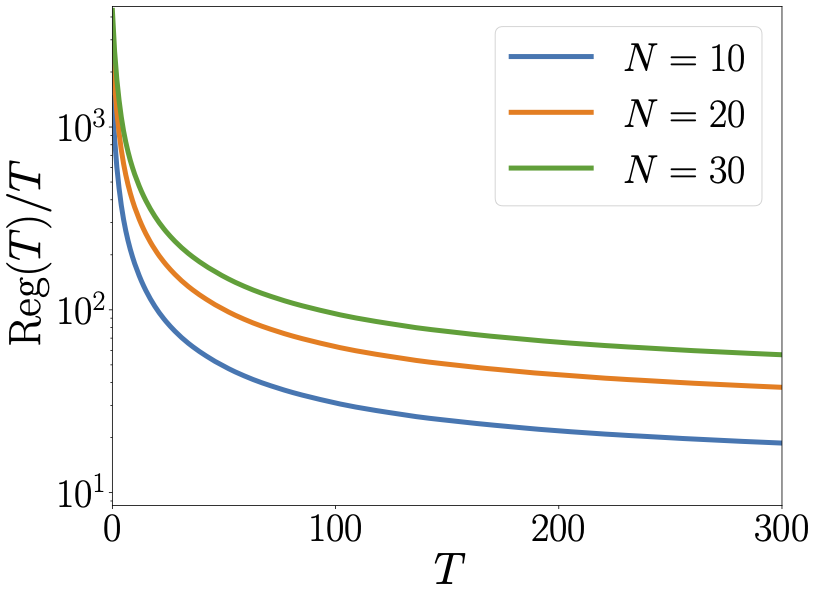
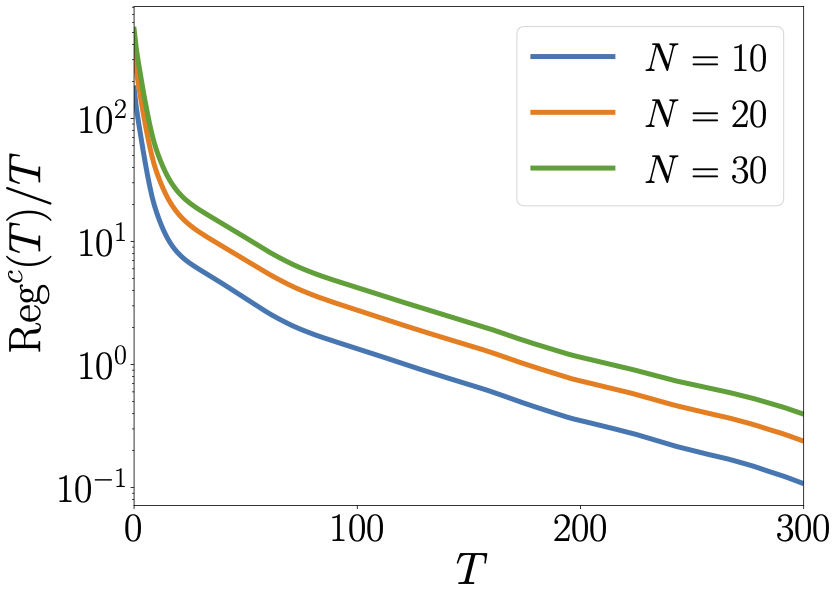
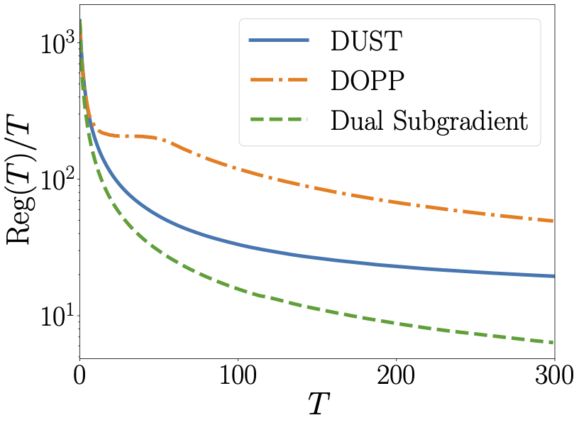
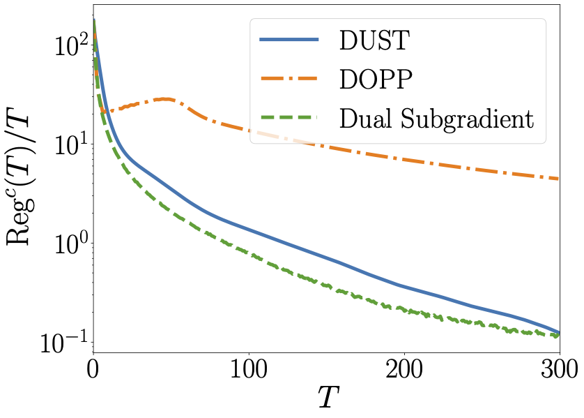

# Distributed Online Optimization with Coupled Inequality Constraints over Unbalanced Directed Networks

This repository contains the numerical experiments in the CDC 2023 paper [*Distributed Online Optimization with Coupled Inequality Constraints over Unbalanced Directed Networks*](https://arxiv.org/abs/2309.01509).
The experiments involve the [plug-in electric vehicles (PEVs) charging problem](https://www.sciencedirect.com/science/article/abs/pii/S0005109816000078), aiming to find the optimal charging schedule over a time period, such that the total charging cost of all PEVs is minimized at each time instance subject to the network power resource constraints.
We investigate the convergence performance of the proposed algorithm, called DUST, and the effects of network connectivity factor $B$ and node number $N$ on the convergence performance.
Additionally, we compare DUST with the [distributed online primal-dual push-sum (DOPP)](https://ieeexplore.ieee.org/abstract/document/9184135) and the [centralized dual subgradient method](https://www.tandfonline.com/doi/abs/10.1057/palgrave.jors.2600425) to demonstrate its competitive performance.

## Description

### Dependencies

The code is written in Python 3.7.7 and requires the following packages:

- [numpy](https://numpy.org/)
- [networkx](https://networkx.org/)
- [cvxpy](https://www.cvxpy.org/)
- [matplotlib](https://matplotlib.org/)

Moreover, a [Tex distribution](https://www.latex-project.org/get/#tex-distributions) is required to render the figures.

### Code structure

- `graph_gen.py`: functions for generating the network topology.
- `data_gen.py`: generate the data for the PEVs charging problem.
- `algorithms.py`: implement DUST, DOPP and the centralized dual subgradient method.
- `compare.py`: functions for comparing the performance of DUST, DOPP and the centralized dual subgradient method.
- `plot.py`: plot the results.

## Results

### Convergence performance of DUST

<table>
    <tr>
        <td></td>
        <td></td>
    </tr>
    <tr>
        <td></td>
        <td></td>
    </tr>
</table>

### Comparison

<table>
    <tr>
        <td></td>
        <td></td>
    </tr>
</table>